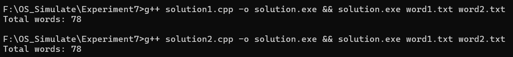
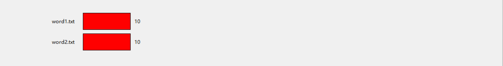
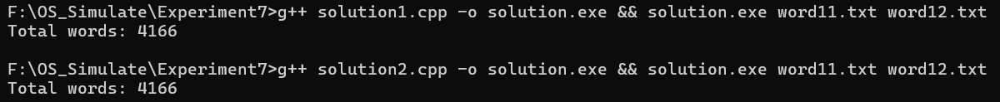
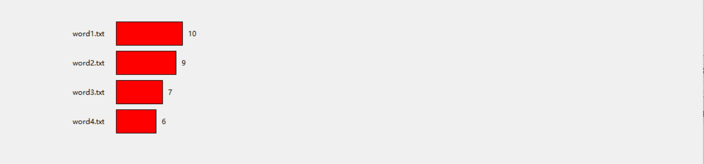
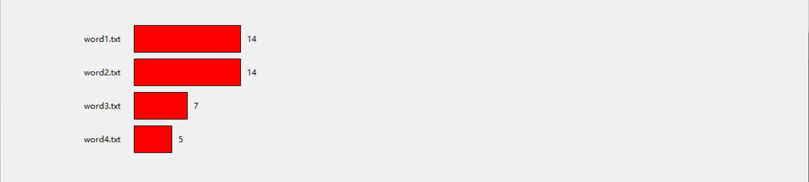
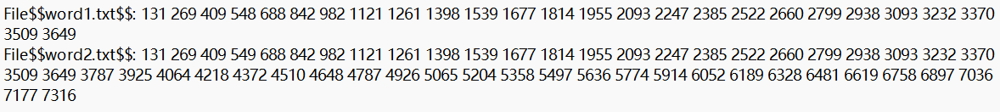

# 进程与线程并发

## 实验环境

操作系统：Windows

g++ 版本：MinGW-W64 x86_64-posix-seh, built by Brecht Sanders 11.2.0

python版本：3.11.2

## 实验目的

#### 本实验将实现多线程统计单词数量. 

凡一个非数字或字母跟在数字或字母后面, 这个数字或字母被视为单词结尾.

本实验将使用两种方式完成上述任务, 并在小样本上可视化, 大样本上测试.

## 实验准备

###### 小样本文件

1. 包含 26 个字母:  a b c ... x y z
2. 包含两组 26 个字母:  a b c ... x y z a b c ... x y z
3. 包含 26 个字母重复 2 次:  aa bb cc ... xx yy zz
4. 包含 26 个字母重复 3 次:  aaa bbb ccc ... xxx yyy zzz

###### 大样本文件

使用 `numpy` 中的文件作为样本测试.

## 实验方法

#### 方法一

两个线程共享一个全局变量 `total_words`

当一个线程扫描到一个单词时, 就更新 `total_words` 变量

对 `total_words` 变量的更新必须互斥访问, 因此, 需要使用 `semaphore` 信号量

最后主程序输出 `total_words` 即可

#### 方法二

两个变量不共享变量, 各自独立统计各自文件的单词数.

当线程结束后, 将统计的单词个数返回给主线程.

主程序等两个线程都结束后, 将两个返回值相加, 得到单词总数.

#### 可视化

线程向 `ans.out` 文件中输出每个单词结束时的时间.

可视化程序从 `ans.out` 中获取时间信息.

根据获取到的时间信息动态还原单词统计的过程.

## 实验步骤

1. 完成方法一的程序, 并在控制台上测试小样本. 

   例如使用命令:  `g++ solution1.cpp -o solution.exe && solution.exe word1.txt word2.txt`

2. 完成方法二的程序, 并在控制台上测试小样本.

   例如使用命令:  `g++ solution2.cpp -o solution.exe && solution.exe word1.txt word2.txt`

3. 完成可视化程序, 并测试小样本.

   例如使用命令:  `g++ solution1.cpp -o solution.exe && solution.exe word1.txt word2.txt && python main.py`

4. 测试大样本.
5. 扩展代码, 根据输入的文件数量创建相应数量的线程.
6. 测试小样本并可视化, 测试大样本.

## 实验结果

#### 小样本终端测试



#### 小样本可视化分析

<div style="text-align:center;">
    <p>
        方法一
    </p>
    
    
    <p>
        方法二
    </p>
    
    
</div>

#### 大样本分析测试



#### 代码扩展测试

<div style="text-align:center;">
    <p>
        方法一
    </p>
    
    
    <p>
        方法二
    </p>
    
    
</div>

## 实验分析

1. 由于 C++ 读写速度过快, 需要在每次 ``getchar`` 后停顿一段固定时间展示差异性. (此处是为了可视化效果, 在大样本测试中不需要)
2. 由于多个线程可能会同时结束, 向 `ans.out` 中写入信息时会错乱, 需要一个信号量互斥写入.
3. 从 ``ans.out`` 的信息中可以看出, 两个线程确实在并发执行. 在资源充足的情况下, 这样做可以很大程度的降低计算所需的时间.

<div style="text-align:center;">
    <p>
        ans.out
    </p>
    
</div>

4. 由于第二种方法不需要互斥访问 ``total_words``, 时间效率更高.

## 附录

实验代码已经上传到 github 仓库.

**solution1.cpp**

```cpp
#include <bits/stdc++.h>
#include <pthread.h>
#include <ctype.h>
#include <semaphore.h>
using i64 = unsigned long long int;

std::ofstream fout("ans.out");
sem_t mutex_write;

auto get_current_time()
{
    auto now = std::chrono::system_clock::now();
    auto timestamp = std::chrono::duration_cast<std::chrono::milliseconds>(now.time_since_epoch()).count();
    return timestamp;
};

auto start_time = get_current_time();

sem_t mutex;
int total_words = 0;
void* count_words(void* arg)
{
	std::vector<i64> time_vec;
	char* filename = (char*)arg;
	FILE *fp;
	int c, prevc = '\0';
	if ((fp = fopen(filename, "r")) != NULL)
	{
		while ((c = getc(fp)) != EOF)
		{
			if (!isalnum(c) && isalnum(prevc))
			{
				sem_wait(&mutex);
				auto cur = get_current_time();
				time_vec.push_back(cur - start_time);
				total_words++;
				std::this_thread::sleep_for(std::chrono::milliseconds(100));
				sem_post(&mutex);
			}
			else std::this_thread::sleep_for(std::chrono::milliseconds(100));
			prevc = c;
		}
		if (isalnum(prevc))
		{
			sem_wait(&mutex);
			auto cur = get_current_time();
			time_vec.push_back(cur - start_time);
			total_words++;
			sem_post(&mutex);
		}
		fclose(fp);
	}
	else
		perror(filename);
		
	sem_wait(&mutex_write);
	
	fout << "File$$" << filename << "$$: ";
	for (auto time :time_vec) fout << time << " ";
	fout << "\n";
	
	sem_post(&mutex_write);
	
	return nullptr;
}

int main(int ac, char *av[])
{
	if (ac < 3)
	{
		printf("Usage:%s file1 file2\n", av[0]);
		return 1;
	}
	
	sem_init(&mutex, 0, 1);
	sem_init(&mutex_write, 0, 1);
	
	std::vector<pthread_t> t(ac);
	for (int i = 1; i < ac; i++)
	{
		pthread_create(&t[i], nullptr, count_words, av[i]);
	}
	
	for (int i = 1; i < ac; i++)
	{
		pthread_join(t[i], nullptr);
	}

	printf("Total words: %d\n", total_words);
	
	sem_destroy(&mutex_write);
	sem_destroy(&mutex);
	
	return 0;
}
```

**solution2.cpp**

```cpp
#include <bits/stdc++.h>
#include <pthread.h>
#include <ctype.h>
#include <semaphore.h>
using i64 = unsigned long long int;

std::ofstream fout("ans.out");
sem_t mutex_write;

struct buf
{
	char* filename;
	int wc_count;
};


auto get_current_time()
{
    auto now = std::chrono::system_clock::now();
    auto timestamp = std::chrono::duration_cast<std::chrono::milliseconds>(now.time_since_epoch()).count();
    return timestamp;
};

auto start_time = get_current_time();

void* count_words(void* arg)
{
	std::vector<i64> time_vec;
	buf* ptr = (buf*)arg;
	char* filename = ptr->filename;
	FILE *fp;
	int c, prevc = '\0';
	if ((fp = fopen(filename, "r")) != NULL)
	{
		while ((c = getc(fp)) != EOF)
		{
			if (!isalnum(c) && isalnum(prevc))
			{
				auto cur = get_current_time();
				time_vec.push_back(cur - start_time);
				ptr->wc_count++;
			}
			else std::this_thread::sleep_for(std::chrono::milliseconds(100));

			prevc = c;
			std::this_thread::sleep_for(std::chrono::milliseconds(1));
		}
		if (isalnum(prevc))
		{
			auto cur = get_current_time();
			time_vec.push_back(cur - start_time);
			ptr->wc_count++;
		}
		fclose(fp);
	}
	else
		perror(filename);
	
	sem_wait(&mutex_write);
	
	fout << "File$$" << filename << "$$: ";
	for (auto time :time_vec) fout << time << " ";
	fout << "\n";
	
	sem_post(&mutex_write);
	
	pthread_exit((void*)&ptr->wc_count);
	return nullptr;
}

int main(int ac, char *av[])
{
	if (ac < 3)
	{
		printf("Usage:%s file1 file2\n", av[0]);
		return 1;
	}
	sem_init(&mutex_write, 0, 1);
	
	std::vector<buf> args(1);
	for (int i = 1; i < ac; i++)
	{
		args.push_back({av[i], 0});
	}
	
	std::vector<pthread_t> t(ac);
	for (int i = 1; i < ac; i++)
	{
		if (pthread_create(&t[i], nullptr, count_words, &args[i]) != 0)
		{
			perror("pthread_create");
			return 1;
		}
	}
	
	std::vector<void*> result(ac);

	for (int i = 1; i < ac; i++)
	{
		pthread_join(t[i], &result[i]);
	}

	int total_words = 0;
	for (int i = 1; i < ac; i++)
	{
		total_words += *((int*)result[i]);
	}
	printf("Total words: %d\n", total_words);

	sem_destroy(&mutex_write);
	return 0;
}
```

**main.py**

```python
r"""
This is the main window of the experiment.
To run the experiment, you can use the following command in the terminal:
g++ .\solution1.cpp -o .\solution.exe && .\solution.exe .\word1.txt .\word2.txt && python .\main.py
"""

import tkinter as tk


class Process:
    def __init__(self, data_arr):
        self.name = data_arr[0]
        self.time_sequence = data_arr[1:]
        self.name = self.name.split("$$")[1]
        self.time_sequence = list(map(int, self.time_sequence))
        self.idx = 0  # cnt = idx
        self.max_idx = len(self.time_sequence)

    @property
    def finished(self):
        return self.idx >= self.max_idx

    def run(self, time):
        while not self.finished and self.time_sequence[self.idx] <= time:
            self.idx += 1
        return self.name, self.idx, self.finished


class Counter:
    def __init__(self, data, step):
        self.processes = [Process(d.split()) for d in data]
        self.processes.sort(key=lambda p: p.name)
        self.step = step
        self.now = 0

    @property
    def finished(self):
        return all(p.finished for p in self.processes)

    def next_moment(self):
        if self.finished:
            return None
        self.now += self.step
        cnt = [p.run(self.now) for p in self.processes]
        return cnt

    @property
    def max_size(self):
        return max(p.max_idx for p in self.processes)


data = open('ans.out', 'r').readlines()
# print(data)
root = tk.Tk()
root.title("柱状图")
canvas_width = 1000
canvas_height = len(data) * 50 + 200  # 每行占50像素高度
root.geometry(f"1200x600")
canvas = tk.Canvas(root, width=canvas_width, height=canvas_height)
canvas.pack()

x_offset = 100  # 起始X偏移量
y_offset = 100  # 起始Y偏移量
bar_height = 40  # 每个柱状图的高度


def display(counts, rate):
    canvas.delete("all")
    for i, (label, length, color_flag) in enumerate(counts):
        # 计算柱状图的长度（按比例缩放至画布宽度）
        bar_length = (canvas_width - 300) * rate * length
        color = "blue" if color_flag else "red"

        # 绘制标签
        canvas.create_text(x_offset - 20, y_offset + i * 50 + bar_height / 2, text=label, anchor="e")

        # 绘制柱状图
        canvas.create_rectangle(x_offset, y_offset + i * 50, x_offset + bar_length, y_offset + i * 50 + bar_height,
                                fill=color)
        # 在柱状图右侧显示长度
        canvas.create_text(x_offset + bar_length + 10, y_offset + i * 50 + bar_height / 2, text=str(length), anchor="w")


def display_animation(data):
    counter = Counter(data, 100)
    rate = 1 / (counter.max_size + 10)  # 缩放比例
    delay = 100  # 刷新时间（毫秒）
    while not counter.finished:
        counts = counter.next_moment()
        canvas.after(delay, display, counts, rate)
        delay += 100


button = tk.Button(root, text="开始动画", command=lambda: display_animation(data))
button.pack()
display_animation(data)
root.mainloop()

```

