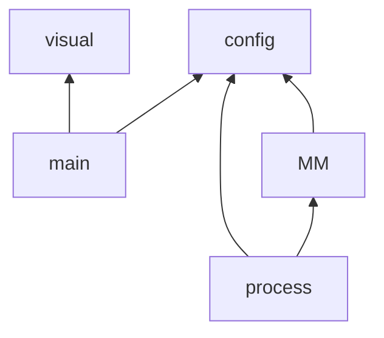

# 存储管理大作业

## 前言

小组分工：

- 陆昊宇：架构设计、可视化实现；
- 董文杰：架构设计、进程类实现、报告撰写；
- 邹琪：内存类实现（申请内存）；
- 沈子毅：内存类实现（释放内存）。

实验环境：

- Windows11
- Python 3.11

实验目的：

- 通过模拟作业的并发运行，体会现代 OS 的并发调度以及并发作业的内存调度过程。

代码仓库：

- https://github.com/Explorer-Dong/OS_Simulate/tree/main/Experiment_final

## 实验过程与结果

为了更好的进行多人协作编程，我们在一开始对项目进行解耦，得到了如下的程序架构（起点对象依赖终点对象）：



其中 main 是程序的入口，visual 表示可视化部分，config 表示程序的所有配置以及所有的互斥锁，MM (main memory) 表示内存，process 表示进程。我们在 main 中定义好所有的进程对象后便开始并发执行所有进程，与此同时启动可视化程序展示进程的内存申请和内存访问的状态。

对于**进程**。所有进程的并发逻辑主要分为以下三步：申请空间、访存逻辑、释放空间。其中申请空间和释放空间都需要修改内存信息，因此需要加互斥锁，并且为了防止申请失败但是又占据了内存访问权限导致死锁，因此在申请空间结束后会返回一个状态码，程序会依据此状态码决定是否需要继续执行进程接下来访存逻辑还是阻塞进程并释放锁。核心代码如下所示：

```python
def run(self) -> None:
    while True:
        ok = self.__acquire_page()  # 拿到申请状态码，如果为 True 则继续执行，否则被阻塞
        if ok:
            self.__execute()
            self.__release_page()
            break
```

对于**内存**。从上面的进程实现可以看出，其需要对内存进行空间申请请求以及空间释放请求，就对应到了内存的申请和释放两个 method。具体的，每一个内存都需要申请 10 个页框，其中 1 个页框用来存储页表，9 个页框用来存储虚页信息。释放的逻辑就与申请类似，分别释放页表和虚页占据的内存空间即可。可视化结果如下所示：

申请内存：


释放内存：


最终可以得到，在第 $i$ 个页面的访问概率为 $\displaystyle \frac{1}{(i+2)^{1/2}}$ 的情况下，整体的缺页率都在 $80\%$ 左右。


## 总结

通过本次实验，我们更加熟悉了现代 OS 中的并发编程以及并发场景下的内存分配、页面替换策略。

## 附录

`config.py`

```python
import threading
import queue

msg_queue = queue.Queue()         # 消息队列
real_page_num = 64                # 实页（页框）数
virt_page_num = 64                # 虚页（页）数
page_size = 256                   # 页面大小（字节）
allocate_per_process = 10         # 每个进程分配的实页数
access_num = 20                   # 每个进程的内存访问次数
process_num = 12                  # 并发进程数
mutex = threading.Semaphore(1)    # 内存访问锁
```

`main.py`

```python
from process import Process
from config import *
import tkinter as tk
from Visualization import Visualization


if __name__ == '__main__':
    # 所有进程开始运行
    processes = []
    threads = []
    for i in range(process_num):
        pid = f'pro {i}'

        pro = Process(pid, access_num=access_num, algo='lru' if i % 2 == 1 else 'fifo')
        processes.append(pro)
        
        thread = threading.Thread(target=pro.run)
        threads.append(thread)
        thread.start()

    # 启动可视化
    root = tk.Tk()
    root.title('Visualization')
    root.attributes('-fullscreen', True)
    root.bind('<Escape>', lambda e: root.attributes('-fullscreen', False))  # 按下Esc退出全屏
    app = Visualization(root)
    root.mainloop()

    # 等所有进程结束后输出每一个进程的缺页中断率
    for thread in threads:
        thread.join()
    for process in processes:
        print(f"{process.pid} 的缺页率为 {process.info()['fail_cnt'] / access_num}")
```

`main_memory.py`

```python
from config import *


class MainMemory:
    def __init__(self):
        self.remain_real_page_num = real_page_num  # 剩余实页的数量
        self.state = [False] * real_page_num       # 实页是否被占用

    def allocate(self, need_page_num: int, pro) -> bool:
        # 内存不够分配
        if need_page_num > self.remain_real_page_num:
            return False

        # 分配页表
        for i in range(len(self.state)):
            if self.state[i]:
                continue
            self.state[i] = True
            self.remain_real_page_num -= 1
            pro.page_table_id = i
            msg_queue.put(
                ("allocate_memory", i, pro.pid)
            )
            break

        # 分配实页
        cnt = 0
        for virt_page_id, row in pro.page_table.iterrows():
            if row['valid']:
                continue

            pro.page_table.loc[virt_page_id, 'valid'] = True
            for i in range(len(self.state)):
                if self.state[i]:
                    continue
                self.state[i] = True
                msg_queue.put(
                    ("allocate_memory", i, pro.pid)
                )
                pro.page_table.loc[virt_page_id, 'real_page_id'] = i
                pro.valid_virt_page_queue.append(virt_page_id)
                break

            cnt += 1
            self.remain_real_page_num -= 1
            if cnt == need_page_num - 1:
                break
        return True

    def free(self, pro) -> None:
        # 释放页表
        self.remain_real_page_num += 1
        real_page_id = pro.page_table_id
        self.state[real_page_id] = False
        msg_queue.put(
            ("free_memory", real_page_id)
        )

        # 释放实页
        for virt_page_id, row in pro.page_table.iterrows():
            if row['valid']:
                self.remain_real_page_num += 1
                real_page_id = row['real_page_id']
                self.state[real_page_id] = False
                pro.valid_virt_page_queue.remove(virt_page_id)
                msg_queue.put(
                    ("free_memory", real_page_id)
                )


main_mem = MainMemory()
```

`process.py`

```python
from config import *
from main_memory import main_mem
import pandas as pd
import numpy as np
import time
from collections import deque


def gen_virt_page_id(data_range: int, sample_num: int) -> list[int]:
    """ 生成 sample_num 个数据，每一个数据的取值范围为 [0,data_range) """
    weights = np.array([1 / np.sqrt(i + 2) for i in range(data_range)])
    weights /= weights.sum()  # 归一化
    virt_page_id = np.random.choice(range(data_range), size=sample_num, p=weights)
    return virt_page_id.tolist()


class Process:
    def __init__(self, pid: str, access_num: int = 200, algo: str = 'lru'):
        self.pid = pid
        self.page_replace_algo = algo                      # 进程的页面替换算法
        self.access_num = access_num                       # 每一个进程访问内存的次数
        self.access_info = {'fail_cnt': 0, 'details': []}  # 访问情况
        self.page_table_id = None                          # 进程页表地址
        self.valid_virt_page_queue = deque()               # 已分配实页的虚页队列
        self.page_table = pd.DataFrame({                   # 进程页表
            'valid': [False] * virt_page_num,
            'real_page_id': [None] * virt_page_num
        })

    def run(self) -> None:
        while True:
            ok = self.__acquire_page()
            if ok:
                msg_queue.put(
                    ('new_page', self.pid, self.page_replace_algo)
                )
                msg_queue.put(
                    ('update_page', self.pid, self.page_table, None)
                )
                self.__execute()
                self.__release_page()
                break

    def info(self) -> dict:
        return self.access_info

    def __acquire_page(self) -> bool:
        mutex.acquire()
        allocate_cond = main_mem.allocate(
            need_page_num=allocate_per_process, pro=self
        )
        mutex.release()
        return allocate_cond

    def __execute(self) -> None:
        # 生成 self.access_num 条逻辑地址（此处只生成虚页号，页内偏移省略）
        virt_page_ids = gen_virt_page_id(virt_page_num, self.access_num)

        # 内存访问
        for virt_page_id in virt_page_ids:
            real_page_id = self.__access_main_mem(virt_page_id)
            msg_queue.put(
                ('update_page', self.pid, self.page_table, virt_page_id)
            )
            self.access_info['details'].append((self.pid, virt_page_id, real_page_id))
            time.sleep(np.random.uniform(0, 0.1))

    def __release_page(self) -> None:
        mutex.acquire()
        main_mem.free(pro=self)
        msg_queue.put(
            ('delete_page', self.pid)
        )
        mutex.release()

    def __access_main_mem(self, virt_page_id: int) -> int:
        # 命中内存，直接返回
        if self.page_table.loc[virt_page_id, 'valid']:
            if self.page_replace_algo == 'lru':
                self.__LRU(virt_page_id)  # 更新 LRU 队列
            return self.page_table.loc[virt_page_id, 'real_page_id']

        # 缺页中断，更新页表
        self.access_info['fail_cnt'] += 1
        if self.page_replace_algo == 'lru':
            self.__LRU(virt_page_id)
        elif self.page_replace_algo == 'fifo':
            self.__FIFO(virt_page_id)
        else:
            raise ValueError(f'页面替换算法 {self.page_replace_algo} 未定义！')

        return self.page_table.loc[virt_page_id, 'real_page_id']

    def __LRU(self, new_virt_page_id: int) -> None:
        # 若本就存在，更新队列顺序即可，无需改页表
        if new_virt_page_id in self.valid_virt_page_queue:
            self.valid_virt_page_queue.remove(new_virt_page_id)
            self.valid_virt_page_queue.append(new_virt_page_id)
            return

        # 若不存在，不但要更新队列，还需要改页表
        self.__FIFO(new_virt_page_id)

    def __FIFO(self, new_virt_page_id: int) -> None:
        # 修改已分配实页的虚页队列
        removed_virt_page_id = self.valid_virt_page_queue.popleft()
        self.valid_virt_page_queue.append(new_virt_page_id)

        # 更新页表
        self.page_table.loc[removed_virt_page_id, 'valid'] = False
        self.page_table.loc[new_virt_page_id, 'valid'] = True
        real_page_id = self.page_table.loc[removed_virt_page_id, 'real_page_id']
        self.page_table.loc[removed_virt_page_id, 'real_page_id'] = None
        self.page_table.loc[new_virt_page_id, 'real_page_id'] = real_page_id
```

`Visualization.py`

```python
import time
import tkinter as tk
from tkinter import ttk
from typing import Iterable
import pandas as pd
from config import msg_queue
import queue


class Visualization(object):
    def __init__(self, master: tk.Tk, realPageNumber=64, pageSize=1000):
        self.realPageNumber = realPageNumber
        self.pageSize = pageSize
        self.master = master

        top_frame = tk.Frame(self.master)
        top_frame.pack(side=tk.TOP)
        self.memory_canvas = tk.Canvas(top_frame, width=400, height=400)
        self.memory_canvas.pack(side=tk.LEFT)
        self.draw_memory()

        button_frame = tk.Frame(top_frame)
        button_frame.pack(side=tk.LEFT)
        ttk.Button(
            button_frame, text="start",
            command=self.start_simulation,
            width=20, padding=30
        ).pack(side=tk.TOP, pady=10)

        ttk.Button(
            button_frame, text="pause",
            command=self.pause_simulation,
            width=20, padding=30
        ).pack(side=tk.TOP, pady=10)

        canvas = tk.Canvas(self.master, width=100, height=400)
        canvas.pack()
        self.page_canvas = [
            tk.Canvas(canvas, width=150, height=400, bg="white")
            for i in range(6)
        ]
        [c.pack(side=tk.LEFT, padx=10, pady=5) for c in self.page_canvas]
        self.id_dict = {}
        self.page8pid = {}

        self.running = False


    def init_page(self, pid: str, replace_algorithm: str):
        canvas_number = -1
        for i in range(6):
            if self.page8pid.get(i, -1) == -1:
                self.page8pid[i] = pid
                self.page8pid[pid] = i
                canvas_number = i
                break

        canvas = self.page_canvas[canvas_number]
        canvas.create_text(
            70, 20,
            text=pid,
            font=("Arial", 15),
        )
        canvas.create_text(
            70, 60,
            text=replace_algorithm,
            font=("Arial", 15),
        )
        canvas.create_rectangle(
            20, 80, 130, 400,
        )
        canvas.create_line(
            75, 80, 75, 400
        )
        height = 35
        id_list = []
        for i in range(9):
            canvas.create_line(
                20, 80 + i * height,
                130, 80 + i * height,
            )
            text_id1 = canvas.create_text(
                45, 80 + height // 2 + i * height,
                text="",
                font=("Arial", 10),
            )
            text_id2 = canvas.create_text(
                100, 80 + height // 2 + i * height,
                text="",
                font=("Arial", 10),
            )
            id_list.append([text_id1, text_id2])
        self.id_dict[canvas_number] = id_list

    def update_page(self, pid: str, page_table: pd.DataFrame, target: int|None):
        canvas_number = self.page8pid[pid]
        id_list = self.id_dict[canvas_number]
        cnt = 0
        for virtual_id, row in page_table.iterrows():
            if row['valid'] is True:
                real_id = row['real_page_id']
                color = "red" if virtual_id == target else "black"
                font = ("Comic Sans MS", 15) if virtual_id == target else ("Arial", 10)
                self.page_canvas[canvas_number].itemconfig(
                    id_list[cnt][0], text=str(virtual_id),
                    fill=color, font=font,
                )
                self.page_canvas[canvas_number].itemconfig(
                    id_list[cnt][1], text=str(real_id),
                    fill=color, font=font
                )

                cnt += 1

    def clear_page(self, pid: str):
        canvas_number = self.page8pid[pid]
        self.page_canvas[canvas_number].delete("all")
        self.id_dict[canvas_number] = []
        self.page8pid.pop(canvas_number)
        self.page8pid.pop(pid)

    def draw_memory(self):
        self.memory_canvas.delete("all")
        width, height = 40, 40
        self.rectangles = pd.DataFrame(
            index=range(8),
            columns=range(8),
        )
        self.memory_text = pd.DataFrame(
            index=range(8),
            columns=range(8),
        )

        for k in range(self.realPageNumber):
            j, i = divmod(k, 8)
            x = i * width + 50
            y = j * height + 50
            rect_id = self.memory_canvas.create_rectangle(
                x, y, x + width, y + height, fill="sky blue",
            )
            text_id = self.memory_canvas.create_text(
                x + width // 2, y + height // 2,
                text="",
                font=("Arial", 10),
            )
            self.rectangles.loc[j, i] = rect_id
            self.memory_text.loc[j, i] = text_id

    def allocate_memory(self, index: int, pid: str):
        j, i = divmod(index, 8)
        rect_id = self.rectangles.loc[j, i]
        text_id = self.memory_text.loc[j, i]
        color = "gray"
        self.memory_canvas.itemconfig(rect_id, fill=color)
        self.memory_canvas.itemconfig(text_id, text=pid)

    def free_memory(self, index: int):
        j, i = divmod(index, 8)
        rect_id = self.rectangles.loc[j, i]
        text_id = self.memory_text.loc[j, i]
        color = "sky blue"
        self.memory_canvas.itemconfig(rect_id, fill=color)
        self.memory_canvas.itemconfig(text_id, text="")

    def solve_message(self, msg):
        """
        1. "allocate_memory", page_number, pid
        2. "free_memory", page_number
        3. "new_page", pid
        4. "update_page", pid, page_table
        5. "delete_page", pid
        """
        match msg[0]:
            case "allocate_memory":
                self.allocate_memory(msg[1], msg[2])
            case "free_memory":
                self.free_memory(msg[1])
            case "new_page":
                self.init_page(msg[1], msg[2])
            case "update_page":
                self.update_page(msg[1], msg[2], msg[3])
            case "delete_page":
                self.clear_page(msg[1])

    def check_msgQueue(self):
        if not self.running:
            return
        try:
            msg = msg_queue.get_nowait()
            self.solve_message(msg)
            self.master.after(200, self.check_msgQueue)
        except queue.Empty:
            self.master.after(100, self.check_msgQueue)

    def start_simulation(self):
        self.running = True
        self.check_msgQueue()

    def pause_simulation(self):
        self.running = False


if __name__ == '__main__':
    root = tk.Tk()
    root.title('Visualization')
    root.attributes('-fullscreen', True)
    root.bind('<Escape>', lambda e: root.attributes('-fullscreen', False))  # 按下Esc退出全屏
    app = Visualization(root)
    root.mainloop()
```

